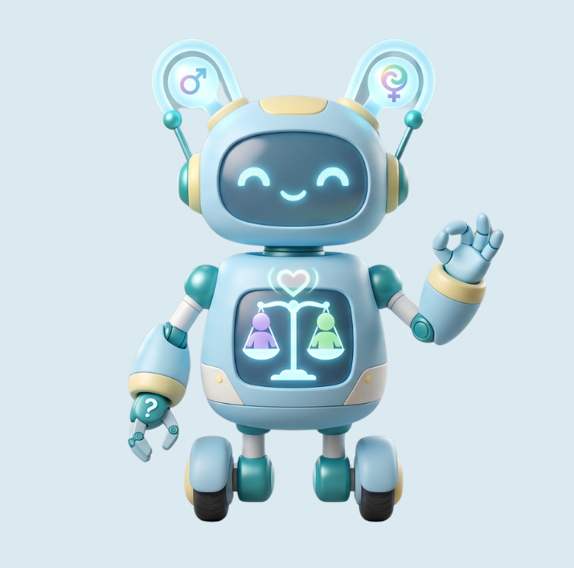

# 🔍 日常的微歧視：校園與職場的隱性偏見偵查線

本專案積極響應聯合國永續發展目標 **SDG 5 性別平權** 與 **SDG 10 減少不平等**，是一套專為辨識日常言語盲點、提供法律自衛導引而開發的輕量化數位倡議互動平台[cite: 28]。



---

## 🕊️ 核心頁面介紹

本平台由以下五大核心網頁檔組成，所有頁面皆採用單一檔案（Single-file）設計，將結構、視覺與互動邏輯完美整合：

1. **倡議主首頁 (`index.html`)**
   整合平台宗旨與模組導覽，以直覺的幾何方塊與微漂浮動態引導使用者開啟反思行動[cite: 27]。
2. **微光匿名故事樹洞 (`anonymous.html`)**[cite: 24]
   核心主打功能[cite: 24]。提供完全去識別化、免除後端洩漏風險的本地端安全發聲牆[cite: 24]。
3. **偏見偵查小隊 (`game1.html`)**[cite: 25]
   輕量化對話解謎測驗[cite: 25]。劃分多個情境事件簿，揭示包裝在善意與常理下的無形微歧視[cite: 25]。
4. **隱性偏見天秤大分類 (`game2.html`)**[cite: 26]
   互動抉擇遊戲[cite: 26]。將日常字卡進行歸類，若觸發潛意識盲點，重力天秤將當場失衡歪斜[cite: 26]。
5. **臺灣性平三法求助指南 (`law.html`)**[cite: 28]
   法律保障安全網[cite: 28]。將艱澀條文轉化為直覺的「自我防衛 3 步驟圖卡」，提供外部法定申訴管道引導[cite: 28]。

---

## 🛠️ 技術實作特點

為了保持專案的輕量化與高可移植性，本平台在開發上具備以下技術亮點：

* **原子化視覺排版**：全面引入 **Tailwind CSS 框架**，直接於 HTML 標籤內建構幾何網格（`grid`），極速實現跨裝置相容的響應式網頁佈局[cite: 24, 25]。
* **原生動態特效**：利用內嵌 CSS 的 `opacity`、`scale` 與 `translateY` 屬性[cite: 25, 26, 27]，打造流暢的減速淡入轉場、天秤失衡歪斜以及首頁卡片的無限循環微懸浮動態[cite: 25, 26, 27]。
* **前端互動邏輯**：利用內嵌 JavaScript 驅動全站的動態核心[cite: 24]，包含天秤歪斜物理機制（DOM 樣式控制）[cite: 26]、選項 Fisher-Yates 隨機洗牌演算法[cite: 25]，並透過 `localStorage` 實現零後端洩漏風險的故事樹洞[cite: 24]。

---

## 📁 儲存庫檔案結構

```text
├── README.md             # 專案說明文件
├── index.html            # 倡議首頁[cite: 27]
├── anonymous.html        # 微光匿名故事樹洞[cite: 24]
├── game1.html            # 偏見偵查小隊[cite: 25]
├── game2.html            # 偏見天秤大分類[cite: 26]
├── law.html              # 平權求助指南[cite: 28]
└── mascot.png            # 平權宣導吉祥物圖片[cite: 27]
